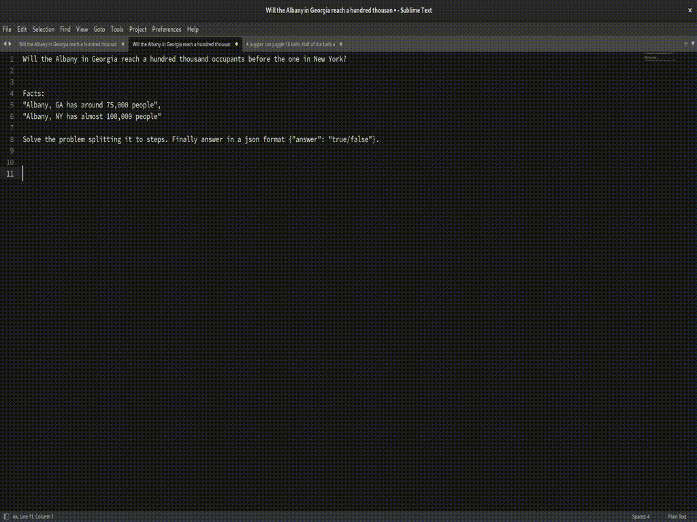

# GAI

GAI is an open‑source Sublime Text plugin that brings generative AI directly into your editor. It helps you generate boilerplate, refactor code, and explore creative solutions, letting you focus on the parts of development that matter most. Built with community contributions in mind, GAI is fully extensible, transparent, and free to use, and maintains full compatibility with the OpenAI API.

## Introduction

GAI seamlessly integrates large language models like GPT-4, GPT-3.5, and other OpenAI-compatible endpoints directly into Sublime Text. The plugin supports multiple AI endpoint configurations, runtime model selection, and fully asynchronous execution integrated into the command palette. Transform your coding workflow with intelligent code generation, refactoring, completion, and editing capabilities.


1. **Code Generation**: Generate new code from scratch or expand existing code with AI assistance
2. **Code Refactoring**: Intelligently rewrite and improve existing code based on instructions
3. **Code Completion**: Get context-aware completions for partial code snippets
4. **Code Whitening**: Clean up and standardize code formatting and style
5. **Multi-Endpoint Support**: Configure multiple AI providers (OpenAI, Azure OpenAI, custom endpoints)
6. **Runtime Model Selection**: Switch between different AI models on-the-fly via quick panel
7. **Asynchronous Execution**: Non-blocking background processing prevents UI freezing
8. **Command Palette Integration**: All commands accessible via Sublime's command palette
9. **OpenAI API Compatible**: Works with any OpenAI-compatible API endpoint
10. **Flexible Configuration**: Command-specific settings with inheritance and overrides
11. **Token Usage Tracking**: Monitor AI usage with per-request token counts
12. **Comprehensive Logging**: Debug requests/responses with configurable logging levels
13. **Extensible Architecture**: Easy to extend with new commands and AI providers
14. **Free and Open Source**: Completely free to use with transparent source code



## Tool Liability Disclaimer

Please keep in mind that code shared with an external partner is transmitted without encryption. For this reason, it should not be used for any sensitive or regulated information, in order to stay compliant with all applicable laws, regulations, and internal policies. If you need to exchange confidential data, please consider using an encrypted channel or a secure potentially on-prem/local alternative.

By using this tool, you acknowledge that you alone are liable for any damage resulting from its use. This tool has no defined intended purpose, and you, the user, assume full responsibility for all legal, financial, social, or other obligations arising from its use. Such responsibility extends to both the use of the tool and any resulting artifacts—including code, text, or other outputs in any format, whether executable or not. The authors of this tool assume no liability.


## Installation

Currently this can only be installed via Github repository. Soon to be integrated in package control directly.

### Easy Install

First you need to add this repository to package control.

1. Bring-up the command palette.
2. Select 'Package Control: Add repository'.
3. Copy paste this repository's URL. 

Subsequently to install GAI:

1. From Sublime
2. Access 'Package Control' (via 'Preferences' or ctrl+shift+p)
3. Select 'Install Package'
4. Wait for packages to load
5. Search and download 'GAI'

## Configuration

Input your OpenAI API key in the Preferences->Package Settings->GAI. 

Prefered way use the command palette to bring up the settings (GAI: Settings). 

The configuration is structured in a format that allows to customize easily both per command but also globally with multiple endpoints.

```json
{
    "oai" : {
        // put your openai connection information here ( consult the configuration for details)
    }, 
    "alternates" : {
        // Allows to provide multiple top-level different configurations, e.g. 
        "my_gpt_4": {
            // ...
        }, 
        "my_gpt_3": {
            // ...
        }
    },
    "commands" : {
        "completions" : {
            // Put the configuration options here such as connection information
            // and other customizations , such as prompt, personas etc.
            "alternates" : {
                // configurations in here will replace top-level alternates 
                // with the same key. New keys will be appended.
                "default": "", // if set to an alternate configuration name it will default to this and user selection is supressed.
            }
        }
    }
}
```

The populated list of the alternates configuration will be shown to the user when the "default" is not set.

## Usage

The plugin offers a set of commands to work content in GAI in a simple intuitive manner following the simplicity of Sublime Text phisolophy.

### Generate Text command

Select the portion of text that you want to send as context to the ai , inclusive of the command. 


For example suppose the text in the editor is:

```
Writing clean and efficient code is crucial for any software development project. 
It not only improves readability but also reduces debugging time. 
Good coding practices can significantly enhance overall code quality.
```

For which we want to expand on each phrase, then command to the large language model can be placed below.

```
Writing clean and efficient code is crucial for any software development project. 
It not only improves readability but also reduces debugging time. 
Good coding practices can significantly enhance overall code quality.

Please for each phrase add more relevant information

```

Subsequently selecting the entire piece of text the Generate Text command can be called through the command palette , search for GAI: Generate Text, e.g. typing `gagi` . Subsequently, select the model from the (searchable) list, and the result can look like:

```
Writing clean and efficient code is crucial for any software development project. It not only improves readability but also reduces debugging time. Good coding practices can significantly enhance overall code quality.

Please for each phrase add more relevant information

Here's an expanded version of the given text with additional relevant information for each phrase:

1. **Writing clean and efficient code is crucial for any software development project.**
   - Clean code is easy to understand and modify, making it easier for developers to collaborate and maintain the codebase over time. Efficient code, on the other hand, ensures that the application performs well, consumes fewer resources, and provides a better user experience. Both aspects are crucial for the success and scalability of a software project.

2. **It not only improves readability but also reduces debugging time.**
   - Readability is enhanced through the use of clear variable names, concise functions, and proper documentation, making it easier for developers to understand the code's intent and functionality. Reduced debugging time is a direct result of clean code practices, as fewer bugs are introduced, and issues are easier to identify and fix when they arise.

3. **Good coding practices can significantly enhance overall code quality.**
   - Good coding practices include following established coding standards, using version control effectively, writing modular and reusable code, and continuously refactoring to improve code structure and performance. By adhering to these practices, developers can ensure that their codebase remains maintainable, efficient, and adaptable to changing requirements.

By emphasizing these aspects, developers can create software that is not only functional but also maintainable, efficient, and of high quality.

```


### Edit command

The **Edit** command lets you ask the LLM to rewrite, refactor, or otherwise change a selected piece of code or text.  
Just like the *Generate Text* workflow, you write the text you want to edit **but** the instruction that tells the model what to do is given on subsequent popup, and the result replaces the highlighted text.

First, write the text you want to edit, and place the content you’d like to change in the editor.

For example, suppose you have a small Python function that needs to be made more “Pythonic” and include type hints:

```python
def add(a,b):
    return a+b
```


Select the whole block you want to change in place (code + instruction), highlight the section and invoke the command. Press **Ctrl + Shift + P** (or Cmd + Shift + P on macOS) to open the command palette, type **`gai edit`**, and choose **`GAI: Edit …`** from the list.

In the subsequent palette input the instruction to the large language text that should be applied onto the text, for example:

```text
Add type hints and make the function conform to PEP‑8 style guidelines.
```

As before, subsequently you can select a model (just press enter to select your default), from a searchable list of available LLMs which will appear. Choose the one you prefer (e.g., `gpt‑4‑turbo`, `claude‑3‑sonnet`, etc.).

The model will replace the selected text with the edited version. For the example above you might get:

```python
def add(a: int, b: int) -> int:
    """Return the sum of two integers."""
    return a + b
```

---

### Tips for Best Results

| ✅ Good practice | ❌ What to avoid |
|------------------|-----------------|
| Keep the instruction **short and explicit** – e.g., “Convert to async function and add error handling.” | Write long, compound instructions that mix several unrelated changes. |
| Mention **only the changes you need**. | Ask the model to “improve everything” without specifying what “improve” means. |
| If you need a specific style, **state it** – e.g., “Use snake_case for variable names.” | Assume the model knows your personal coding conventions. |
| Include **any required context** (imports, surrounding code) in the selection. | Leave out code that the model might need to understand the change. |

---

